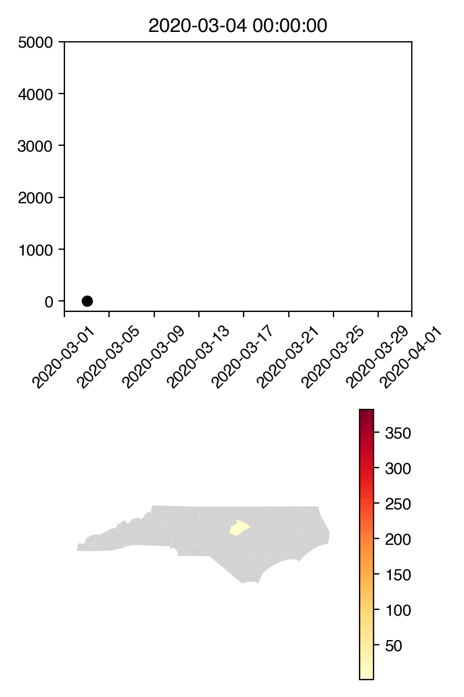

# UNC-CompMed-SARS-CoV-2

Work done on modeling and visualizing the SARS-CoV-2 pandemic by members of the Computational Medicine Program at The University of North Carolina at Chapel Hill. 

## Projects

### NC COVID-19 Visualization

#### Objective 
Develop a clear visualization demonstrating the number of confirmed SARS-CoV-2 cases in North Carolina over time and by county. 

#### Data sources 

* County break down is from the [News and Observer](https://www.newsobserver.com/news/local/article241168731.html) 
* Deaths are from [1point3acres](https://coronavirus.1point3acres.com/en)
* Testing data is from [The COVID-19 Tracking Project](https://covidtracking.com/data/state/north-carolina/#history)

#### Visualizations

GIF showing cases in North Carolina by county from March 3, 2020 to March 30, 2020 

## Contributors

* Amy Pomeroy 
* ADD YOUR NAME HERE IF YOU CONTRIBUTE 
